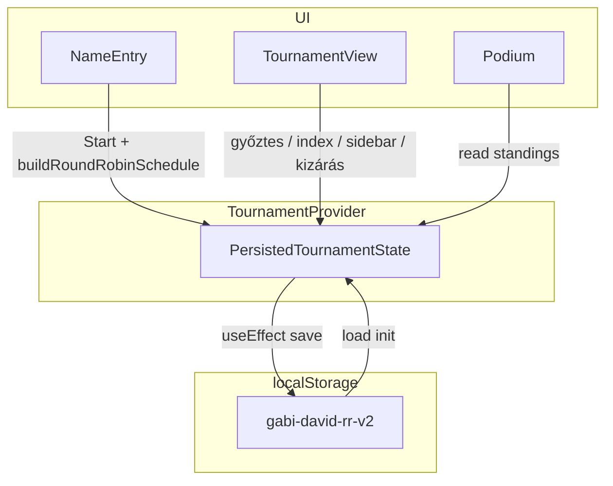

# Architektúra

## Rétegek

| Réteg      | Mappa                                           | Szerep                                                                              |
| ---------- | ----------------------------------------------- | ----------------------------------------------------------------------------------- |
| Domain     | `src/domain/`                                   | Tiszta TypeScript: round-robin ütem, rangsor számítás. Nincs React, nincs `window`. |
| Storage    | `src/storage/`                                  | `localStorage` sérializáció, verzió, sérült adat kezelése.                          |
| Alkalmazás | `src/context/`, `src/components/`, `src/hooks/` | UI, útvonalak, állapot, persist effekt.                                             |

## Adatfolyam

## Domain

- **`roundRobin.ts`**: Berger / kör módszer; páratlannál belső `__bye__` sentinel. Bemenet: játékos `id` lista **sorrendben**. Kimenet: `ScheduledMatch[]` stabil `id` mezőkkel (`r{round}-p{slot}`).
- **`standings.ts`**: `computeStandings(players, matches, results, excludedPlayerIds)` → rendezett sorok. Kizárt játékosok és az ő meccseik nem számítanak.
- **`types.ts`**: közös típusok.

## Persistált állapot

`PersistedTournamentState` (`src/storage/tournamentStorage.ts`):

- `version`, `view` (`setup` | `tournament` | `results`)
- `players`: `{ id, name }[]`
- `excludedPlayerIds`: kizárt játékosok id listája
- `matches`: ütem vagy `null` setupban
- `currentMatchIndex`
- `matchResults`: `matchId → winnerPlayerId`
- `sidebarCollapsed`

Betöltéskor: üres `tournament` / `results` inkonzisztencia esetén **setup**-ra kényszerítés; `currentMatchIndex` clamp a meccsekhez.

Menet közbeni kizáráskor a `TournamentProvider`:

- hozzáadja a játékost az `excludedPlayerIds` listához,
- kiszűri a hozzá tartozó meccseket a `matches` tömbből,
- törli az így kieső meccsek eredményeit a `matchResults` mapből.

## Útvonal szinkron

A `TournamentProvider` navigál **Start** / **Befejezés** / **Visszaállítás** eseménykor. Az egyes oldalak `useEffect`-tel védik az útvonalat (pl. üres ütemmel ne maradjon `/jatek`).

## Tesztek

- **Vitest** + **jsdom** + `@testing-library/jest-dom` (`src/setupTests.ts`).
- Domain és storage **unit** tesztek fájlnév: `*.test.ts`.
- Komponens tesztek később: `*.test.tsx`, RTL import `@testing-library/react`.

## Build

Vite + `@vitejs/plugin-react`; `vite.config.ts` tartalmazza a `test` blokkot is.
